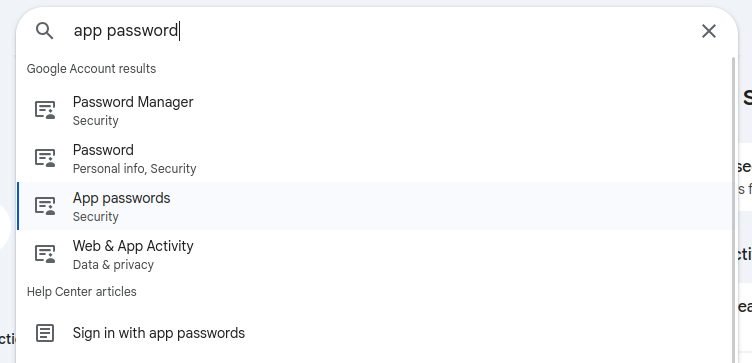
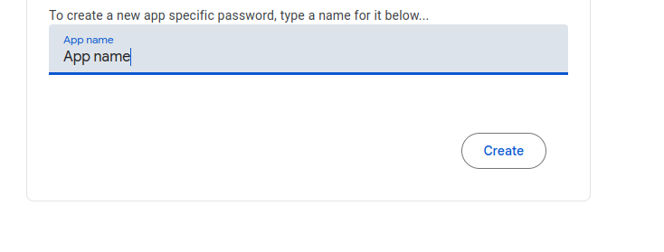

# 📬 Gmail Telegram Bot

A powerful Telegram bot that forwards your Gmail messages to Telegram with AI-powered features including smart categorization, automatic code extraction, and intelligent reply generation.


## ✨ Features

| Feature | Description |
|---------|-------------|
| 📧 **Real-time Email Forwarding** | Automatically checks for new emails and sends them to your Telegram |
| 🏷️ **Smart Categorization** | AI-powered email categorization with hashtags (#job_offer, #urgent, #spam, etc.) |
| 🔐 **Code Extraction** | Automatically extracts verification codes, OTPs, and PINs from emails |
| 📝 **Smart Summaries** | AI-generated summaries for long emails |
| ↩️ **Reply Functionality** | Reply to emails directly from Telegram |
| 🤖 **AI Reply Generation** | Generate intelligent replies using GPT-4o-mini |
| 📬 **Multi-Account Support** | Monitor multiple Gmail accounts simultaneously |
| 🔄 **Message Tracking** | Only sends new messages, never duplicates |

## 🖼️ Preview

### Bot in Action
When you receive a new email, the bot will:
1. Categorize it with a hashtag
2. Extract any verification codes
3. Provide a summary (for long emails)
4. Show reply and AI generate buttons

```
#security

📧 From: Google Security
📬 To: your-email@gmail.com
📝 Subject: Security Alert

🔐 Code: 123456

────────────────────
Summary: Google detected a new sign-in to your account...

[↩️ Reply] [🤖 Generate]
```

## 🚀 Quick Start

### Prerequisites

- Python 3.8 or higher
- Telegram Bot Token (from [@BotFather](https://t.me/BotFather))
- Gmail Account with App Password
- OpenAI API Key (optional, for AI features)

### Installation

1. **Clone the repository**
   ```bash
   git clone https://github.com/Az1mbek-Xak1mov/gmail-tg-bot.git
   cd gmail-tg-bot
   ```

2. **Create virtual environment (recommended)**
   ```bash
   python -m venv .venv
   source .venv/bin/activate  # Linux/macOS
   # or
   .venv\Scripts\activate     # Windows
   ```

3. **Install dependencies**
   ```bash
   pip install -r requirements.txt
   ```

4. **Configure the bot**
   ```bash
   cp config.example.py config.py
   nano config.py  # Edit with your credentials
   ```

5. **Run the bot**
   ```bash
   python main.py
   ```

## 🔑 Getting Gmail App Password

To allow the bot to access your Gmail, you need to create an **App Password**. Follow these steps:

### Step 1: Open Google Account Settings

Go to [Google Account](https://myaccount.google.com/) and search for **"app password"** in the search bar:



Click on **"App passwords"** under Security.

> ⚠️ **Note:** You must have 2-Step Verification enabled to see this option.

### Step 2: Create App Password

Enter a name for your app (e.g., "Gmail Telegram Bot") and click **Create**:



### Step 3: Copy the Password

Google will generate a 16-character password. **Copy this password** - you'll need it for `config.py`.

> 🔒 **Security Note:** This password is shown only once. Store it securely!

### Enable IMAP

1. Open Gmail → Settings (⚙️) → See all settings
2. Go to **Forwarding and POP/IMAP** tab
3. Enable **IMAP Access**
4. Save Changes

## ⚙️ Configuration

Edit `config.py` with your credentials:

```python
# Telegram Bot Token (from @BotFather)
TOKEN = "1234567890:ABCdefGHIjklMNOpqrsTUVwxyz"

# Your Telegram User ID (get it from @userinfobot)
TG_RECEIVER = 123456789

# Gmail accounts: (email, app_password, your_name)
MAIL_BOXES = [
    ('your-email@gmail.com', 'xxxx xxxx xxxx xxxx', 'John Doe'),
    ('another@gmail.com', 'yyyy yyyy yyyy yyyy', 'Jane Smith'),
]

# OpenAI API Key (optional - leave empty to disable AI features)
OPENAI_API_KEY = "sk-..."

# Check interval in seconds
UPDATE_INTERVAL = 60
```

### Configuration Options

| Option | Description | Required |
|--------|-------------|----------|
| `TOKEN` | Telegram Bot API token | ✅ Yes |
| `TG_RECEIVER` | Your Telegram user ID | ✅ Yes |
| `MAIL_BOXES` | List of Gmail accounts (email, app_password, name) | ✅ Yes |
| `OPENAI_API_KEY` | OpenAI API key for AI features | ❌ Optional |
| `UPDATE_INTERVAL` | Email check interval in seconds | ✅ Yes |

## 📁 Project Structure

```
gmail-tg-bot/
├── main.py              # Main bot logic and handlers
├── config.py            # Configuration (git-ignored)
├── config.example.py    # Configuration template
├── receive_mail.py      # IMAP email receiving
├── format_mail.py       # Email formatting for Telegram
├── tracker.py           # Message ID tracking
├── ai_processor.py      # OpenAI integration
├── prompts.txt          # AI system prompts
├── requirements.txt     # Python dependencies
├── data/
│   └── last_ids.json    # Tracked message IDs
└── README.md
```

## 🤖 AI Features

When `OPENAI_API_KEY` is configured, the bot enables:

### 📂 Smart Categorization
Emails are automatically categorized with hashtags:
- `#job_offer` - Job opportunities
- `#urgent` - Time-sensitive emails
- `#spam` - Spam/unwanted emails
- `#newsletter` - Newsletters and subscriptions
- `#security` - Security alerts and codes
- `#finance` - Financial notifications
- `#social` - Social media notifications
- `#promotion` - Promotional emails
- `#personal` - Personal messages
- `#other` - Uncategorized

### 🔐 Code Extraction
Automatically extracts:
- Verification codes
- OTP (One-Time Passwords)
- PIN codes
- Registration codes

### 📝 Smart Summaries
Long emails are automatically summarized to 2-3 sentences.

### 🤖 AI Reply Generation
Click "Generate" to create an AI-powered response, then:
- ✅ **Send** - Send the generated reply
- ✏️ **Edit** - Manually edit before sending
- ❌ **Cancel** - Discard the generated reply

> 💡 **Tip:** If `OPENAI_API_KEY` is empty or invalid, the bot works normally without AI features.

## 💬 Bot Commands

| Command | Description |
|---------|-------------|
| `/start` | Start the bot and show welcome message |

### Inline Buttons

| Button | Action |
|--------|--------|
| ↩️ Reply | Reply to the email |
| 🤖 Generate | Generate AI reply (if AI enabled) |
| ✅ Send | Send the generated reply |
| ✏️ Edit | Edit the reply manually |
| ❌ Cancel | Cancel the operation |

## 🔧 Troubleshooting

### "Authentication failed"
- Make sure you're using the **App Password**, not your regular Gmail password
- Check that IMAP is enabled in Gmail settings
- Verify the email address is correct

### "No new messages"
- The bot only sends **new** messages after it starts
- Check that emails are in the **Inbox** and marked as **Unread**
- Verify the email account credentials in `config.py`

### "AI features not working"
- Verify your `OPENAI_API_KEY` is valid
- Check your OpenAI account has API credits
- The bot works without AI if the key is empty or invalid

### Bot not responding
- Make sure only one instance of the bot is running
- Check the terminal for error messages
- Verify your Telegram `TOKEN` and `TG_RECEIVER` are correct

## 🛡️ Security Best Practices

1. **Never commit `config.py`** - It's in `.gitignore` for a reason
2. **Use App Passwords** - Never use your main Gmail password
3. **Restrict bot access** - Only your `TG_RECEIVER` can receive emails
4. **Regular rotation** - Periodically regenerate App Passwords
5. **Secure your OpenAI key** - Treat it like a password

## 📦 Dependencies

- `aiogram>=3.0` - Telegram Bot framework
- `beautifulsoup4>=4.11.0` - HTML parsing
- `openai` - OpenAI API client (optional)

## 🤝 Contributing

Contributions are welcome! Please feel free to submit a Pull Request.

1. Fork the repository
2. Create your feature branch (`git checkout -b feature/AmazingFeature`)
3. Commit your changes (`git commit -m 'Add some AmazingFeature'`)
4. Push to the branch (`git push origin feature/AmazingFeature`)
5. Open a Pull Request

## 📄 License

This project is licensed under the MIT License - see the [LICENSE](LICENSE) file for details.

## 👤 Author

**Azimbek Hakimov**

- GitHub: [@Az1mbek-Xak1mov](https://github.com/Az1mbek-Xak1mov)

---

⭐ Star this repo if you find it useful!
